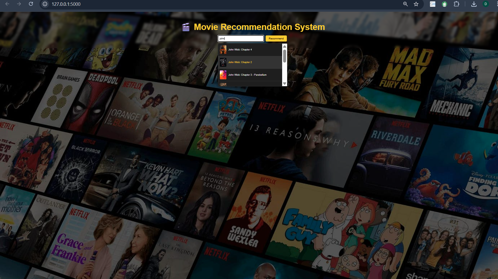
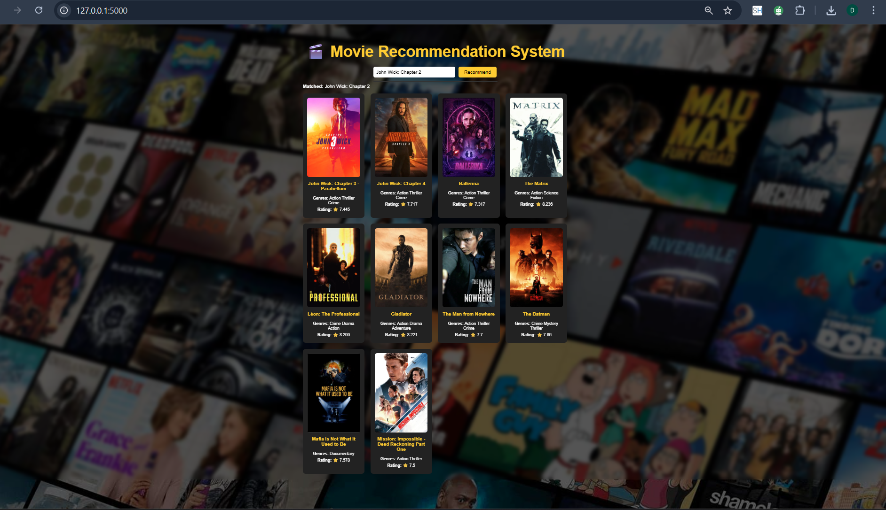
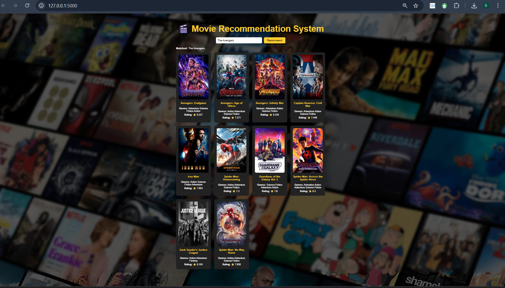

# Movie Recommendation System

A Flask-based movie recommender that serves similarity-based suggestions using precomputed TF-IDF features and cosine similarity, with an optional ML re-ranker.

## Project Structure
- [app.py](app.py): Flask backend exposing recommend/search/suggest endpoints.
- [templates/index.html](templates/index.html): Front-end page with search, recommendations, and live suggestions.
- [static/style.css](static/style.css): Styling for the UI.
- [models/](models/models_2): Saved artifacts (`tfidf_vectorizer.pkl`, `tfidf_matrix.npz`, `cosine_similarity.npy`, `df_movies.csv`).
- [data/movies_with_images.csv](data/movies_with_images.csv): Source data (titles, metadata, and poster URLs).
- [requirements.txt](requirements.txt): Python dependencies.


## Quick Start
1. Install dependencies:
   ```bash
   pip install -r requirements.txt
   ```
2. Run the Flask server:
   ```bash
   python app.py
   ```
3. Open the UI at `http://127.0.0.1:5000` and search for a movie.


## Screenshots








## Training (optional)
- To rebuild TF-IDF matrices, cosine similarity, and the SVM model, run:
  ```bash
  python main.py
  ```
- Artifacts will be written to the `models/` directory and loaded by `app.py`.

## API
- `GET /recommend?title=<movie>&top_n=10` → Returns matched title and top recommendations.
- `GET /search?query=<text>` → Returns fuzzy-matched titles for autocomplete.
- `GET /suggest?query=<text>` → Returns suggestion list with posters.

## Notes
- Title matching uses normalized text and fuzzy matching from [`find_movie`](app.py).
- Recommendation scoring blends cosine similarity and normalized ratings in [`recommend`](app.py); the ML re-ranker logic lives in [`recommend_ml`](main.py).
